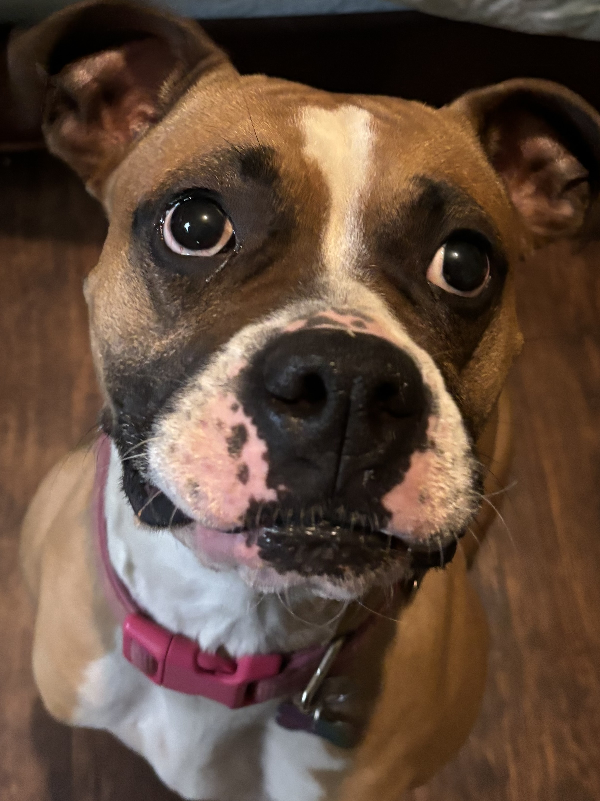

Hi 👋 My name is Olivia Sharpston
=================================
I have been at the University of North Alabama for three years now! My love for computing stemmed in high school. While I was in high school, a computer science class got introduced and became available. I had started this class in my 2019-2020 school year. When COVID had happened, I transitioned to online. Nonetheless, I came out with highest average in that class. That class gave me the inspiration to become a computing major. To stray away, here is a photo of my pup, Maple! She is a 4.5 year old boxer. I've had her since November 2020!

* 🌍  I'm based in Florence, AL
* ✉️  You can contact me at [oksharpston617@gmail.com](mailto:oksharpston617@gmail.com)
* 🧠  I'm learning many skills to be able to achieve my undergraduate degree in Information Technology. Furthermore, I am gaining the tools for my concentration of HCI/UX.
* ⚡  Fun Fact: I used to live in Colorado!

### Skills

### Socials

 <a href="https://www.facebook.com/olivia.sharpston" target="_blank" rel="noreferrer"> <picture> <source media="(prefers-color-scheme: dark)" srcset="https://raw.githubusercontent.com/danielcranney/readme-generator/main/public/icons/socials/facebook-dark.svg" /> <source media="(prefers-color-scheme: light)" srcset="https://raw.githubusercontent.com/danielcranney/readme-generator/main/public/icons/socials/facebook.svg" />  </picture> </a> <a href="https://www.github.com/Olivia-Sharpston" target="_blank" rel="noreferrer"> <picture> <source media="(prefers-color-scheme: dark)" srcset="https://raw.githubusercontent.com/danielcranney/readme-generator/main/public/icons/socials/github-dark.svg" /> <source media="(prefers-color-scheme: light)" srcset="https://raw.githubusercontent.com/danielcranney/readme-generator/main/public/icons/socials/github.svg" />  </picture> </a> <a href="http://www.instagram.com/oliviak0617/" target="_blank" rel="noreferrer"> <picture> <source media="(prefers-color-scheme: dark)" srcset="https://raw.githubusercontent.com/danielcranney/readme-generator/main/public/icons/socials/instagram-dark.svg" /> <source media="(prefers-color-scheme: light)" srcset="https://raw.githubusercontent.com/danielcranney/readme-generator/main/public/icons/socials/instagram.svg" />  </picture> </a> <a href="https://www.linkedin.com/in/olivia-sharpston-58844735a/" target="_blank" rel="noreferrer"> <picture> <source media="(prefers-color-scheme: dark)" srcset="https://raw.githubusercontent.com/danielcranney/readme-generator/main/public/icons/socials/linkedin-dark.svg" /> <source media="(prefers-color-scheme: light)" srcset="https://raw.githubusercontent.com/danielcranney/readme-generator/main/public/icons/socials/linkedin.svg" />  </picture> </a> <a href="https://www.threads.net/@oliviak0617" target="_blank" rel="noreferrer"> <picture> <source media="(prefers-color-scheme: dark)" srcset="https://raw.githubusercontent.com/danielcranney/readme-generator/main/public/icons/socials/threads-dark.svg" /> <source media="(prefers-color-scheme: light)" srcset="https://raw.githubusercontent.com/danielcranney/readme-generator/main/public/icons/socials/threads.svg" />  </picture> </a>

### Badges

<b>My GitHub Stats</b>

